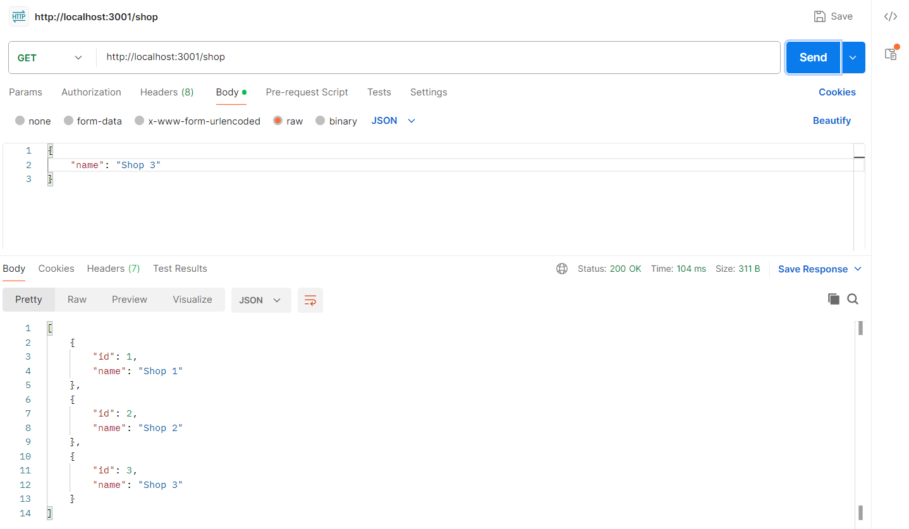
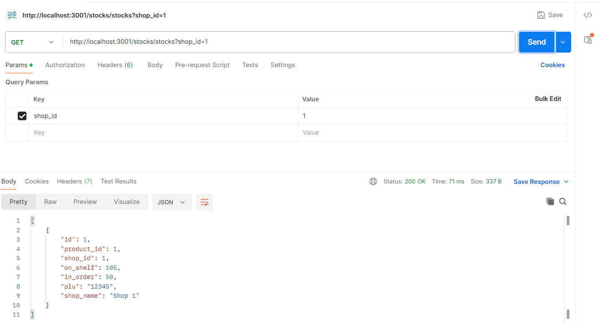

# effective-mobile
# Inventory System and NestJS User Service Documentation

## Overview Inventory System

This project includes two services:

1. **Stock Service**: Manages products, shops, and stock levels (Port: **3001**).
2. **History Service**: Handles action logs for products and shops (Port: **3002**).

Both services communicate with each other and are containerized using Docker. 

---

## Installation and Setup

### Prerequisites

1. Install [Docker](https://docs.docker.com/get-docker/).
2. Install [Docker Compose](https://docs.docker.com/compose/install/).

### First-Time Setup

1. Clone the repository:
   ```bash
   git clone https://github.com/namuruiwatani/effective-mobile.git
   cd inventory-system
   ```

2. Build and start the services:
   ```bash
   docker-compose up --build
   ```
---

## API Endpoints

### Stock Service (Port: **3001**)

#### **1. Manage Products**

**Create a Product**  
- **POST** `/products`
- **Example**:
- 

**Get Products with filter plu**  
- **GET** `/products?plu=<plu>`
- **Example**:
- 

**Get Products with filter name**  
- **GET** `/products?name=<name>`
- **Example**:
- 

#### **2. Manage Shops**

**Create a Shop**  
- **POST** `/shops`
- **Example**:
- 

**Get Shops**  
- **GET** `/shops`
- **Example**:
- 

#### **3. Manage Stocks**

**Create a Stock Record**  
- **POST** `/stocks`
- **Example**:
- 

**Update Stock Levels type (in order : on shelf) (Increase)**  
- **PATCH** `/stocks/increase/:id`
- **Example in order**:
- 
- **Example on shelf**:
- 


**Update Stock Levels type (in order : on shelf) (Decrease)**  
- **PATCH** `/stocks/decrease/:id`
- **Example in order**:
- 
- **Example on shelf**:
- 

**Fetch Stocks**  
- **GET** `/stocks`
- **Example filter plu**:
- 
- **Example filter shop_id**:
- 
- **Example filter stocks in shelf max**:
- 
- **Example filter stocks in shelf min**:
- 
- **Example filter stocks in order max**:
- 
- **Example filter stocks in order min**:
- 

---

### History Service (Port: **3002**)

#### **1. Log an Action**
- **POST** `/actions`
- **Body JSON**: 
 ```json
  {
  "action_type": "string",
  "product_id": "number",
  "shop_id": "number",
  "plu": "string",
  "details": { "key": "value" }
}
  ```

#### **2. Fetch Action Logs**
- **GET** `/actions`
- **Example**:
- 

#### **3. Fetch Action Logs with filter shop_id**
- **GET** `/actions?shop_id=1`
- **Example**:
- 

#### **4. Fetch Action Logs with filter plu**
- **GET** `/actions?plu=165275`
- **Example**:
- 

#### **5. Fetch Action Logs with filter date**
- **GET** `/actions?date_of=<date>`
- **Example**:
- 

#### **5. Fetch Action Logs with filter action type**
- **GET** `/actions?action_type=<action_type>`
- **Example**:
- 

#### **5. Fetch Action Logs with nav**
- **GET** `/actions?page=<page-number>`
- **Example**:
- 

---

## Overview NestJS User Service

This project is a **NestJS-based User Service** designed to manage a database of users, track their problem status, and reset it when needed. It demonstrates the usage of NestJS with TypeORM for handling database operations and features a seeding script to populate the database with mock data.

---

### Steps to Run the Project

1. Clone the repository:
   ```bash
   cd nestjs-user-service
   ```

2. Build and run the project using Docker Compose:
   ```bash
   docker-compose up --build
   ```

   This will build the application and start all required services, including the database.

3. Seed the database with mock data:
   ```bash
   docker exec -it nestjs-user-service npm run migration:run
   ```

   This command runs the seeding script to populate the database with random 1000000 user records
   - **Example**:
   - 

4. The service will be available at [http://localhost:3000](http://localhost:3000).

---

## API Endpoints

### **Reset Problems**

- **Description**: Resets the `problems` flag for all users with `problems = true` and returns the count of affected users.
- **Method**: `GET`
- **Endpoint**: `/users/reset-problems`
- **Example**:
- 

---

